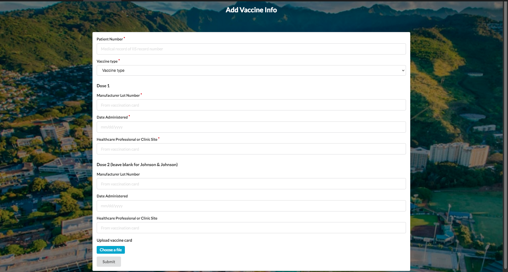

For ICS 491, where we participate in two hackathons, we created a COVID tracking app as a warmup before the hackathons started. The app uses a Meteor, Mongo, React stack to prepare us for the Meteor Hackathon we plan to participate in. The app's functionality is based on the UH Manoa [Lumisight app](https://uh.campus.lumisight.com/). Users are able to sign up, log in, upload a timestamped symptom check, and upload their vaccine information (with a photo!).

A lot of the work I did on this app had to do with Dates, specifically the JavaScript Date object. Properly displayed and recorded dates were important for this app. The day of a vaccine being administered or of an individual being clear of COVID symptoms are important information with how infectious the virus is. I made sure the dates were stored and displayed correctly on the List Status page, as well as making the Edit Status page functional (which also displays the date of the symptom report). 

The most important addition I made to the application was the Add Vaccine form/page (pictured on the right) and Vaccine Record table under List Status. This required a new table in the database and was a rather involved form due to all the information required for a vaccine. Displaying the information was also tricky, especially in the outlier case of the Johnson & Johnson vaccine which has no second dose, so the date of the second dose displayed needed to be N/A. 

The experience developing this application taught me a lot. As stated, a lot of the work I did involved dates in some capacity, so I gained a lot of familiarity with the format of JavaScript dates. I also took somewhat of a leadership position on this project, helping to think of and divide tasks. So I learned a lot in that respect too, figuring out how to divide up the development of the app into tasks an individual could take on.

[See the GitHub repo](https://github.com/ICS491-Fall2021/covid-tracker) 
||
[See the deployed application](https://covid-tracker.meteorapp.com/)

