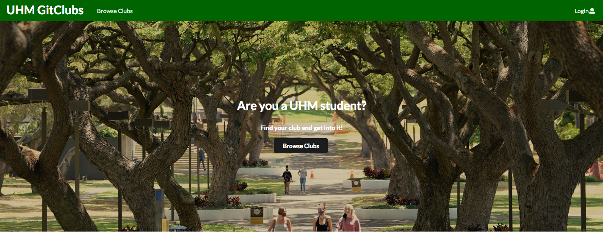

For our final project in ICS 314, we split into groups and were tasked with building a web application using the software engineering concepts we learned throughout the semester. The project was built mostly with JavaScript, and uses a Meteor, Mongo, React, Semantic UI stack. 

For the project, I mostly worked on the “create club” form, which was also the basis for the “edit clubs” form. For this form, I had to allow users to submit data describing a club (name, description, image, link to website, etc.) and use that to add a club to the databases so that it will display on the other pages which display clubs. Some fields in this form are not required, but we needed matching placeholder data for the database (for example, any club that didn’t provide an image got the UH manoa logo as their image). 

I learned a lot from this experience as it was one of my first full stack projects. Since we were working in a group setting we used agile project management, this was the first time I followed any sort of project management guidelines. I learned how important it is to have constant meetings when things are constantly changing, and how useful version control is for the same reason. I learned how important communication is for figuring out the big picture on a project and how everyone's pieces will fit together.

[See the GitHub organization](https://github.com/uhm-gitclubs) 
||
[See the project homepage](https://uhm-gitclubs.github.io/)

