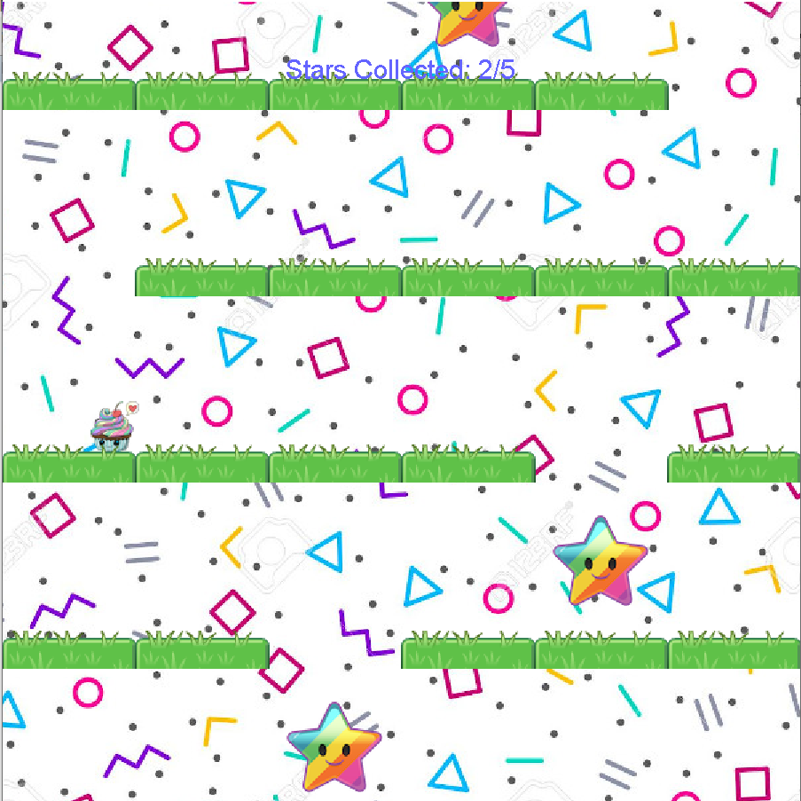

For our final project in ICS 111, we were tasked with building a game that incorporated elements of what we learned throughout the semester. It is made in java and uses the EZ.java library to incorporate graphics and sound. The gameplay consists of constantly rising platforms that carry your character to the top of the screen and get faster as more stars are collected. Allowing the platforms to make your character touch the top of the screen will result in a game over. The goal is to maneuver between the gaps in the platforms and fall to the bottom of the screen, ideally after collecting all of the stars for the "true ending". 

I wrote most of the actual code for this project, including the game logic (I wrote the MainProgram file). This includes the collision, left-and-right looping screen (think Pac-Man), gravity effect, and the game's mechanic of speeding up as more stars are collected. One element I worked on that I think turned out particularly well was the parallax effect created by the quickly moving foreground and slow moving background.

I learned a lot from this experience as it was my first time working in a group setting for a programming project (besides crypto clicker which required less coordination due to its simple nature). I learned that it is quite difficult to work on the same file/code if things are not explained well (such as with bad commenting). I learned how important communication is for figuring out the big picture on a project and how everyone's pieces will fit together. 

Link to github repository coming soon!
//You can see the code on this github repository: [Cupcake game code on github](link).

