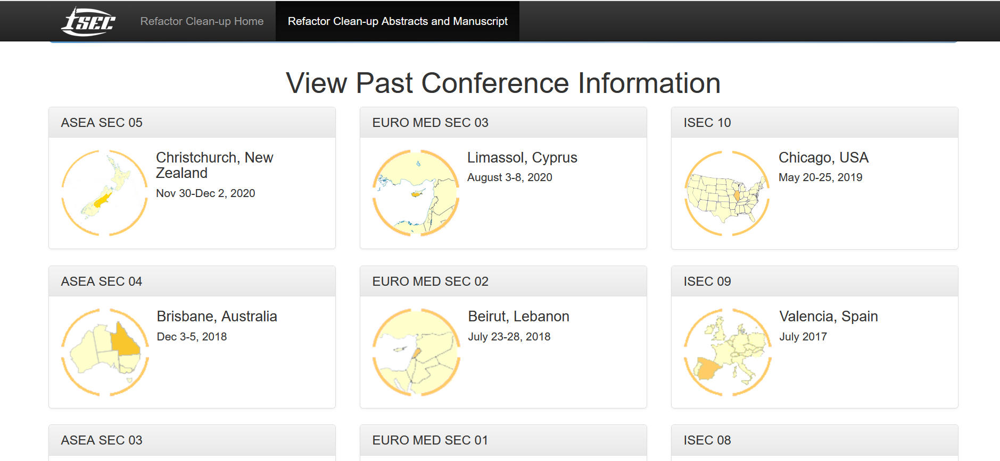

  
  

The International Structural Engineering and Construction \[ISEC] Society is a journal/publication. They publish research papers of many different topics and hold semi-annual conferences where authors who have had their works published can present their works. There is a system in place for authors to submit their abstracts which will be reviewed and potentially accepted, in which case authors can submit the full manuscript for review. A new branch of the website is created after each conference, where the publications are viewable.

I started working with the ISEC society only recently, and so have only worked on a few of the pages visible on the site. One of the pages I have made is a page which shows the registration form for all previous conferences (image above). Besides working on the web site, I also provide suport for those having issues with the website, as well as provide authors with things they can't generate themselves: like certificates for registration. 

Working on the ISEC society website gave me a lot of experience with full-stack development and web application design. I had to learn how the website development languages (HTML, CSS, PHP, Javascript) all work together, and also learn to use MySQL. Working on this website is also a constant test of working on top of code other people made, which can be quite difficult without having them present to ask questions. I also have to make sure I do not inadvertently break anything whenever I add new things, and make sure they adhere to the current flow/structure of the website.

See the [ISEC Society Website](https://www.isec-society.org/index.php/). 
