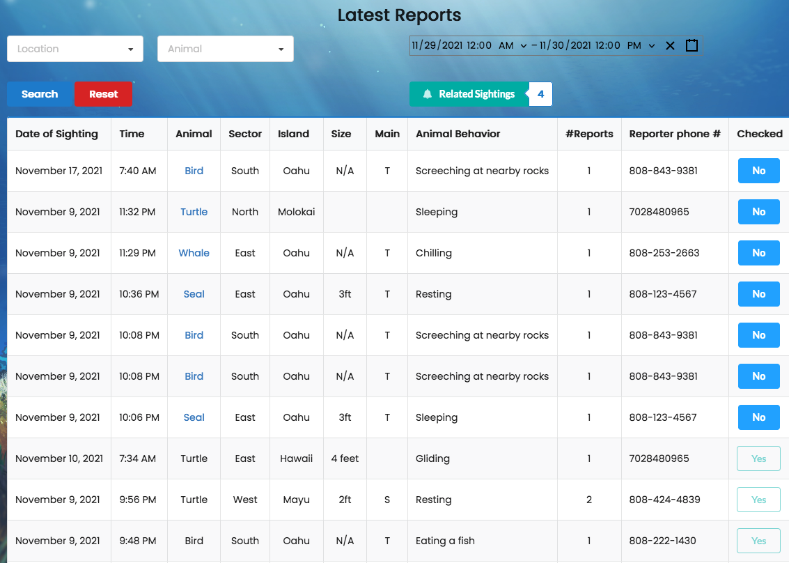
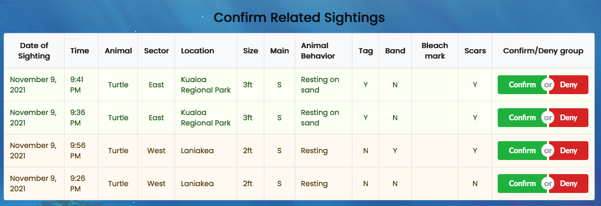

## The Challenge 

For the [2021 HACC](https://hacc.hawaii.gov/) my group took on the challenge of implementing a marine life reporting & sighting app. Hawaii Marine Animal Reponse (HMAR) desired an app to help managing the large amount of reports they get (all through a phone line) for sightings of endangered species of birds, seals, and turtles.

## The App

Our implementation has a mobile app for beach-goers to submit a form for any sightings they make, with all the relevant information that HMAR volunteers need about the sighting. This data is then displayed on our webview which is exclusively for use of HMAR staff and volunteers to view reports of sightings.

For this app, I primarily worked on the Latest Reports and Confirm Sightings pages. The latest reports page shows all reports that users have submitted through the app, in reverse chronological order. Each row has the important info on a sighting, and a field to indicate if the report has been "Checked" and is no longer of concern. Unchecked reports can be edited or deleted by clicking on the animal type, and appear at the top of the sorting regardless of date.

The confirm related/related sightings page has a similar view, with rows of sightings in a table displaying the important info. These sightings are in groups (with alternating colors) that were detected as being similar to each other (due to factors like location or time being very similar). HMAR wanted a way to cut down on the number of duplicate reports they get, so this page allows an HMAR volunteer to distinguish at a glance whether a group of reports are the same or not. If they decide the group of reports are not actually the same sighting, they can click no, in which case the sightings will be confirmed as distinct and seperated into two rows in the Latest Reports page. Otherwise, the sightings will be grouped together as one row on the Latest Reports page.

## Conclusion

I learned a lot from the experience with this hackathon. After the very short Meteor Hackathon this one was very different in pace. We definitely slowed down at the start of this hackathon to catch our breath after the sprint that was the Meteor Hackathon. Once we did get this marathon (4 weeks!) started, we had to take time to learn about mobile app development, this was my first time doing anything with a mobile app, so I was thankful for my teammates who were more versed with it. On the web view side of things, the database tables for this app had more fields than I have worked with in any project. There were many pieces of data that HMAR wanted to be stored for each report, which also led to the form being quite long and complex. This made working with the data (such as when inserting or updating) 

[See the GitHub repo](https://github.com/HACC2021/DAAJ) 
||
[See the deployed application](https://daaj.meteorapp.com/)

